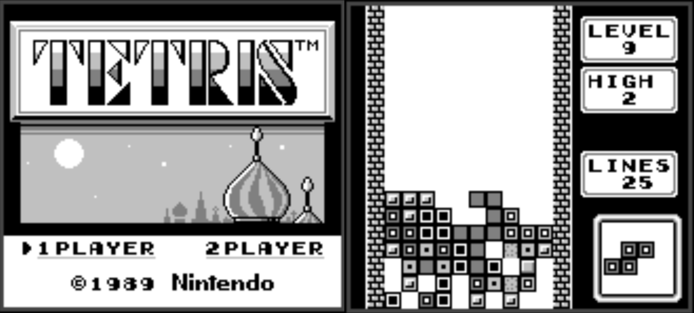

# Game Boy Emulator

A simple Game Boy emulator written in C++ using SDL2.



## Dependencies

* [SDL2](https://www.libsdl.org/)

## Installation and Usage

```sh
$ git clone https://github.com/joshjennings98/game-boy-cpp
$ cd Gameboy
$ make
$ ./gameboy <rom>
```

### Notes

* Sound not implemented.
* Only tested to ensure Tetris is working.